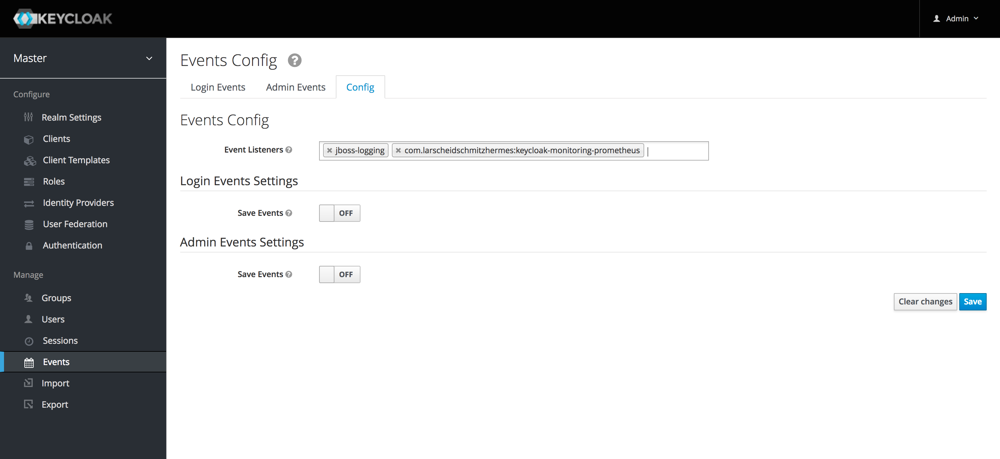

[](https://jitpack.io/#larscheid-schmitzhermes/keycloak-monitoring-prometheus)
[](https://jitpack.io/#larscheid-schmitzhermes/keycloak-monitoring-prometheus)

# keycloak-monitoring-prometheus
Out of the box, `keycloak` does not expose any metrics about what it is doing.
It does however allow you to write code that is listening to all kinds of keycloak-internal events.
This project counts those events and allows you to expose them to `prometheus` with the [`prometheus-filesystem-exporter`](https://github.com/larscheid-schmitzhermes/prometheus-filesystem-exporter).
## What metrics do you get?
This project will help you expose two metrics:

- `keycloak_events_total` with labels
    - realm="String",
    - type="[`org.keycloak.events.EventType`](https://github.com/keycloak/keycloak/blob/master/server-spi-private/src/main/java/org/keycloak/events/EventType.java)",
    - client_id="String",
    - ip_address="String"
- `keycloak_admin_events_total` with labels
    - realm="String"
    - operation="[`org.keycloak.events.admin.OperationType`](https://github.com/keycloak/keycloak/blob/master/server-spi-private/src/main/java/org/keycloak/events/admin/OperationType.java)"
    - resource="[`org.keycloak.events.admin.ResourceType`](https://github.com/keycloak/keycloak/blob/master/server-spi-private/src/main/java/org/keycloak/events/admin/ResourceType.java)",
    - client_id="String",
    - ip_address="String"

The magic lies in the labels. The labels basically expose the underlying keycloak event details and allow for detailed filtering. The unique metric + label combination's value will be increased by one whenever an event of this type is emmited in keycloak.
## Setup
### Install SPI
The code in this project compiles into an SPI that needs to be installed to your keycloak instance.
The simplest way is to download the latest JAR [from jitpack.io](http://jitpack.io/com/github/larscheid-schmitzhermes/keycloak-monitoring-prometheus/master/keycloak-monitoring-prometheus-master-SNAPSHOT.jar) and put it into your keycloak installation directory/providers.
Detailled instructions on SPI installation can be found in the [keycloak docs](http://www.keycloak.org/docs/3.3/server_development/topics/providers.html).
Also make sure to check out the [`Dockerfile`](Dockerfile).
### Configure SPI
The SPI requires you to provide a configuration option describing where to write the event counter files.
#### Configuring in standalone.xml
SPI configuration happens in keycloaks `standalone.xml`.
Within `<subsystem xmlns="urn:jboss:domain:keycloak-server:1.1"></subsystem>` you need to add the following lines:
```xml
<spi name="eventsListener">
    <provider name="com.larscheidschmitzhermes:keycloak-monitoring-prometheus" enabled="true">
        <properties>
            <property name="eventsDirectory" value="/metrics"/>
         </properties>
    </provider>
</spi>
```
For a more advanced example (directory name read from env variable) see the [`Dockerfile`](Dockerfile) again.
#### Configuring using an environment variable
The metrics directory can be specified by setting the `KEYCLOAK_PROMETHEUS_EVENTS_DIR` environment variable.
This value will only be used if the `eventsDirectory` configuration value is not set or if it is an empty string.
### Configuration in keycloak

In keycloak's admin console under `Events > Config` you need to add `com.larscheidschmitzhermes:keycloak-monitoring-prometheus` as an Event Listener.
Make sure you do this for every realm you want to monitor!
#### Configuring using Keycloak CLI
Keycloak supports scripting of configuration changes via CLI. This has the benefit of decoupling configuration changes from the deployed keycloak version allowing easy upgrades of binaries. This is especially beneficial in a containerized environment.
### Using CLI to configure Keycloak
To configure the Prometheus exporter via CLI see [`Dockerfile`](Dockerfile).
The content of [`jboss-cli`](jboss-cli) is added with `jboss-cli.sh` and `embed-server mode`. During docker build you will see Keycloak adding the configuration entries to `standalone.xml`.
For more information refer to [`Keycloak documentation`](https://www.keycloak.org/docs/7.0/server_installation/#cli-scripting)

### Getting your metrics into prometheus
Once everything is setup in keycloak, you will start seeing files like `keycloak_admin_events_total;realm=master;operation=CREATE;resource=USER` in your configured events directory.
These files contain a number stating how often an event with the given parameters was emitted.
The naming scheme is compatible with [`prometheus-filesystem-exporter`](https://github.com/larscheid-schmitzhermes/prometheus-filesystem-exporter),
which you should run next to keycloak to get your events exposed in a prometheus compatible format.
